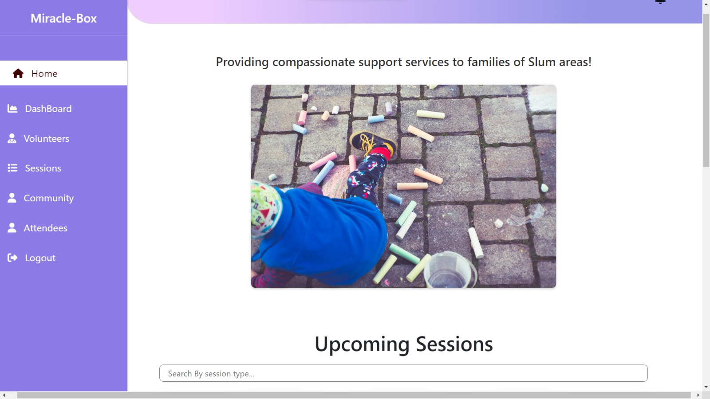
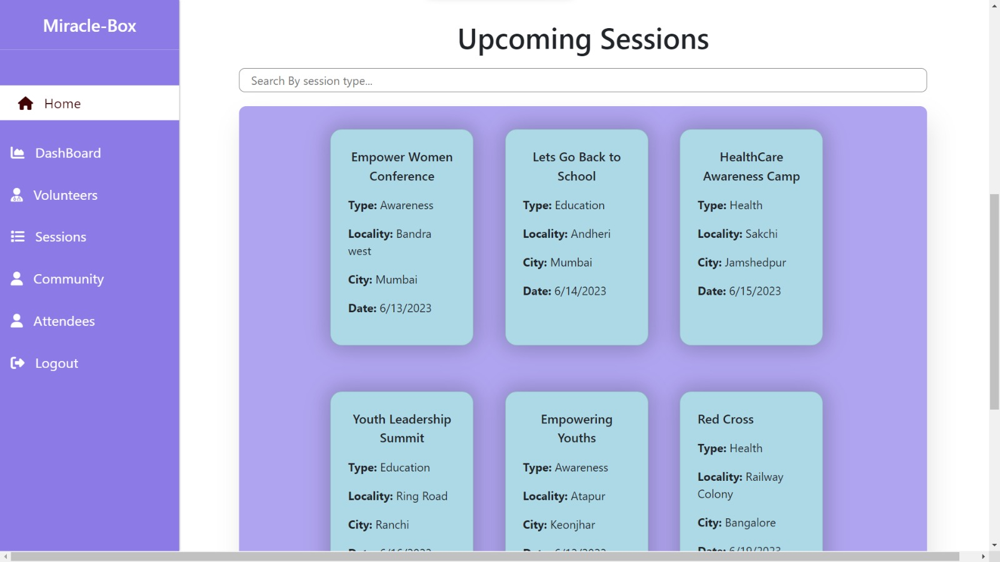
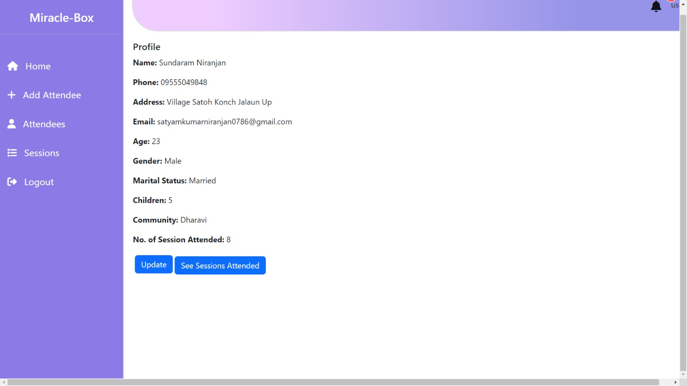
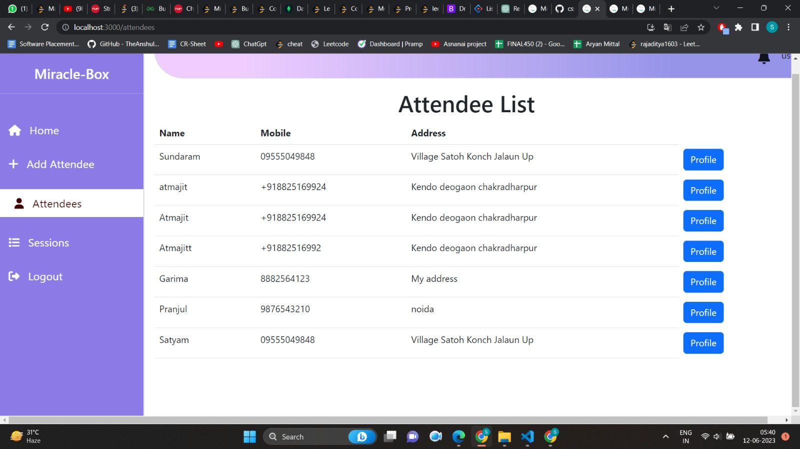
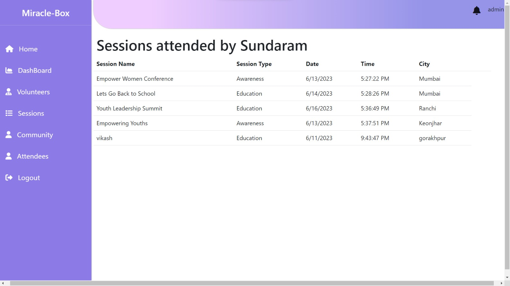
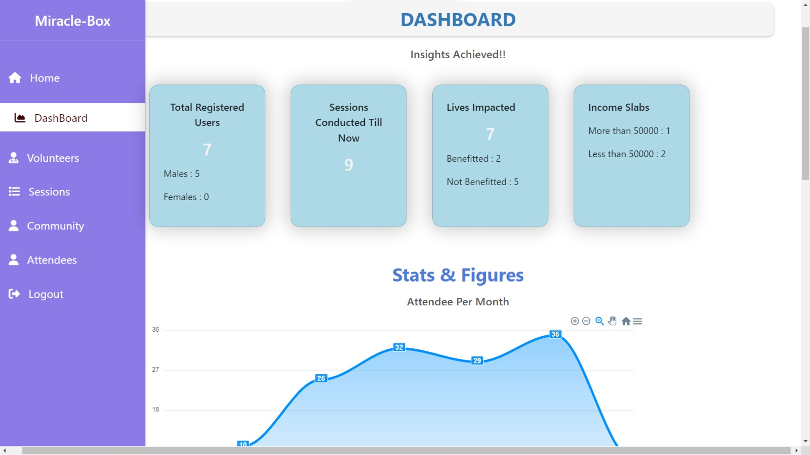
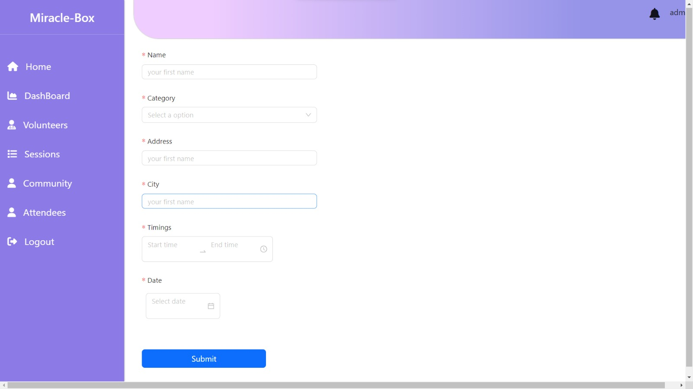
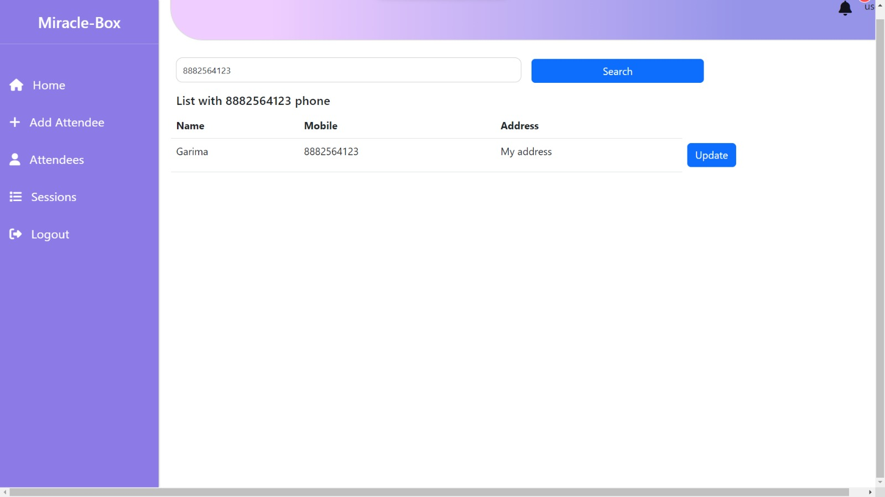
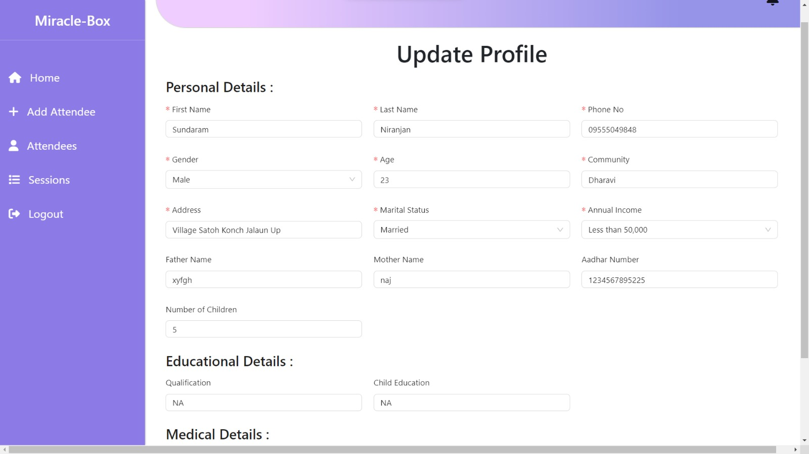
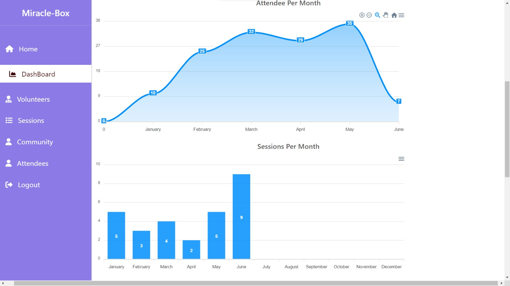

# CodeToGive23

## Getting Started
A user-friendly web application that allows to collect demographic and sociographic data of the people who attend and are benefited from the sessions organised by the nonprofit conclude some useful insights from the data and visualise in the form of charts or graphs which in result will help in tracking and monitoring the progress.

## PPT Link
[Link](https://drive.google.com/file/d/1ImUu4B7tAvkgvYzGnj1KROeUC-UNYDmk/view)

## Tech Stack

1. Node js
2. Express js
3. React js
4. JavaScript
5. MongoDB
6. CSS
7. HTML
8. Bootstrap
9. Chart Js
10. Bcrypt

  ## Contributors:

Team Name: Team 22

* [Satyam Niranjan](https://github.com/SatyamKumarNiranjan)
* [Vikash Singh](https://github.com/VikashSingh0007)
* [Atmajit Sahoo](https://github.com/atmajitsahu100)
* [Sachin Mishra]()
* [Garima Pandey](https://github.com/garima1710)
* [Pritesh Mishra](https://github.com/pritesh-sh21)

### Installation instructions
1. Clone folder from github .
2. Run " npm i " for node modules for frontend as well backend.
2. For backend run npm start.
3. For frontend run npm start.

## Features
1. User-Friendly Interface: Designed an intuitive and user-friendly interface for the attendee management system, ensuring ease of use for both administrators and attendees. This promotes seamless registration, session scheduling, and progress tracking.

2. Community Registration: Implemented a seamless attendee registration process, allowing individuals to join specific communities of interest and fostering a sense of belonging and engagement.

3. Community Management: Developed a community management feature that enables administrators to add, update, and manage communities efficiently. This ensures proper organization and categorization of attendees.

4. Session Scheduling: Designed and implemented a scheduling system to facilitate the planning and coordination of sessions or events for each community. This feature optimizes community engagement and participation.

5. Attendance Management: Developed an attendance tracking system to accurately record and update attendees' participation in specific sessions. This ensures reliable data for evaluating community engagement and individual progress.

6. Progress Tracking: Leveraged available data to track and monitor the progress of communities and attendees. Implemented visual representations, such as charts or progress indicators, to provide clear insights into growth, participation, and achievements.

7. Volunteer Approval: Created a streamlined process to review and approve volunteer requests within communities. This feature ensures efficient utilization of volunteer resources and enables community members to actively contribute to community activities.

8. Impact Assessment: Implemented a mechanism to track the benefits attendees derive from each session. Developed metrics and data analysis methods to assess the impact of sessions on attendee skill development, knowledge acquisition, or overall progress.

9. Data Analysis and Reporting: Utilized data analysis techniques to derive actionable insights from attendee data. Created comprehensive reports and dashboards that provide valuable information on community engagement, attendance trends, and session effectiveness.

10. Continuous Improvement: Demonstrated a commitment to continuous improvement by actively seeking feedback from attendees and community leaders. Incorporated feedback into system enhancements, resulting in an improved attendee experience and more effective community management.

## Screenshots

  
  

      

  
  

      

  
  

  

  
  

  

  
  

  

  
  

    

  
  

    

  
  

  

  
  

  

  
  

 

